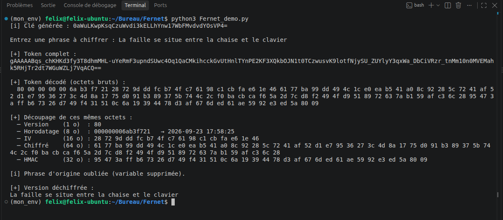

# Anatomie d'un token chiffré (illustré avec Fernet)

Une donnée chiffrée sérieuse contient bien plus que le message : elle embarque
de quoi prouver son **intégrité** et sa **fraîcheur**. Ce post décortique un
token **Fernet** octet par octet pour le montrer concrètement.

> **Idée clé : encoder ≠ chiffrer.** Le token qui circule est juste *encodé*
> pour voyager. Ce qui le protège, c'est la clé — pas son apparence.


## Le programme

Vous tapez une phrase. Le programme la chiffre, ouvre le token pour afficher ses champs un par un, puis "oublie" la phrase et la reconstruit sans l'avoir gardée en mémoire — uniquement depuis le token et la clé.

```bash
pip install -r requirements.txt
python3 fernet_demo.py
```



## Que contient un token ?

Une fois le base64 décodé, un token Fernet est une suite d'octets à structure **fixe** :

| Champ | Taille | Rôle |
|---|---|---|
| Version | 1 o | Format du token (toujours `0x80`) |
| Horodatage | 8 o | Date de chiffrement (secondes depuis 1970) |
| IV | 16 o | Valeur aléatoire propre à ce chiffrement |
| Chiffré | n o | Le message chiffré (multiple de 16 o) |
| HMAC | 32 o | Signature de tout ce qui précède |

C'est parce que les tailles sont fixes qu'on peut **découper** le token sans clé.

## Deux visages du même token

Le décorticateur affiche le token sous deux formes. C'est la **même information**,
juste habillée différemment :

| | Token complet | Token décodé |
|---|---|---|
| Aspect | `gAAAAA...` (texte) | `80 00 00 ...` (binaire) |
| Encodage | base64url | octets bruts |
| Rôle | transmis et stocké | représentation interne |
| Secret? | non | non — seul le champ *Chiffré* l'est |

Pour imager : le base64 est l'**enveloppe** (faite pour voyager), les octets bruts
sont la **lettre**. Ouvrir l'enveloppe ne révèle pas le message : la lettre reste
chiffrée. N'importe qui peut décoder le base64 — ça ne donne accès à rien sans la
clé. La sécurité ne repose **jamais** sur l'encodage.

## Ce que chaque champ protège

| Mécanisme | Menace contrée |
|---|---|
| Chiffrement AES-128 | Lecture du message (confidentialité) |
| IV aléatoire | Analyse par motifs : 2 messages identiques → 2 tokens différents |
| HMAC-SHA256 | Falsification : modifier un octet casse la signature (`InvalidToken`) |
| Horodatage | Rejeu : un token peut être daté et périmé (`decrypt(token, ttl=...)`) |

> IV, horodatage et HMAC sont **gérés automatiquement** par Fernet.

## Ce que le token ne protège pas

| Limite | Détail |
|---|---|
| Longueur | Le champ *Chiffré* grossit par paliers de 16 o : sa longueur trahit la tranche de taille du message (ici 48–63 o), sans en donner la valeur exacte |
| Horodatage en clair | On sait *quand* le message a été chiffré |
| Structure publique | Le format est connu : le base64 est un emballage, pas une défense |
| Partage de la clé | Chiffrement symétrique : si la clé fuit, tout tombe. Fernet ne dit pas comment la transmettre |

## À retenir

- Un token = message chiffré **+ preuve d'intégrité + fraîcheur**, pas juste le message.
- **Encoder ≠ chiffrer** : la clé protège, l'encodage transporte.
- L'IV rend le brute-force plus coûteux côté attaquant — voir mon projet
  *démonstrateur de brute-force* pour le côté offensif.